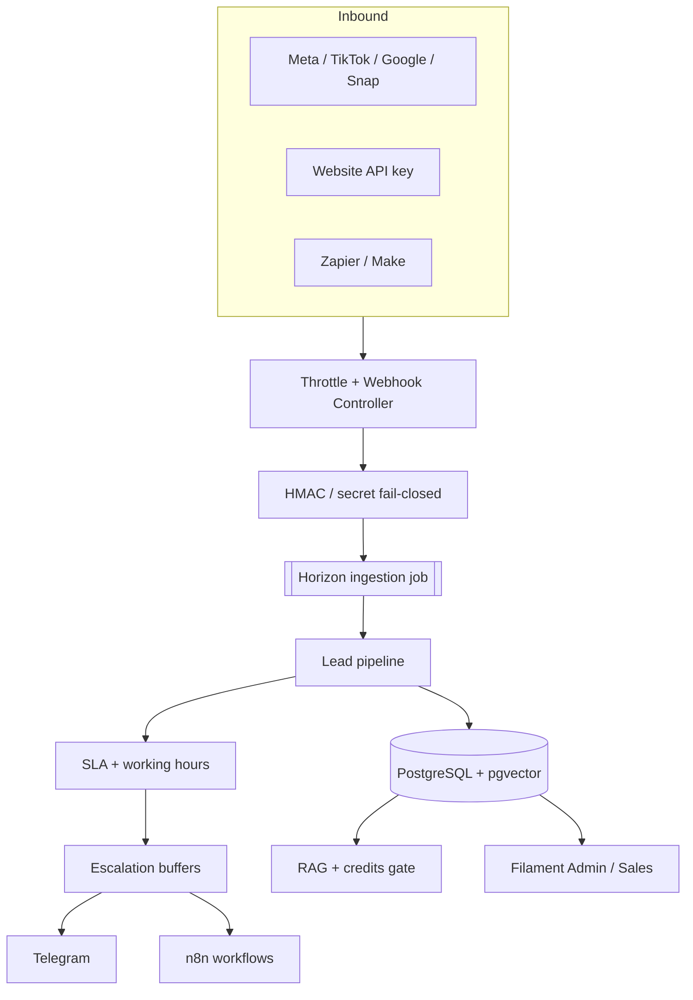

# FirstTouch SLA

**Multi-tenant lead distribution & business-hours SLA engine** — with AI RAG, Telegram alerts, and n8n automation.

[CI](https://github.com/yousefbzaqout/firsttouch-sla/actions/workflows/ci.yml)
[PHP](#tech-stack)
[Laravel](#tech-stack)
[License: MIT](LICENSE)
[Security](SECURITY.md)

[Features](#feature-gallery) · [Architecture](#architecture) · [Quick start](#quick-start) · [API](#api--webhooks) · [Docs](docs/ARCHITECTURE.md)

FirstTouch SLA on a Lenovo Legion display — Leads inbox with SLA badges

*Hero · Lenovo Legion screen-only · light Filament UI · Nova Realty showcase data*

---


## What it is

FirstTouch SLA helps sales teams **answer inbound leads in minutes, not hours**.

Leads arrive from Meta, TikTok, Google, Snapchat, website forms, and Zapier/Make. The system verifies signatures **fail-closed**, assigns agents safely, starts a **timezone-aware SLA clock**, escalates through buffers, can answer with **confidence-gated RAG**, and notifies humans via **Telegram** / **n8n**.

Built as an enterprise-shaped portfolio system: strict multi-tenancy, SOLID adapters, Horizon queues, Pest + PHPStan Level 8.

---


## Why teams buy this shape of product


| Buyer pain                            | FirstTouch answer                                           |
| ------------------------------------- | ----------------------------------------------------------- |
| Ads spend wasted when leads go cold   | SLA clock + breach / warning / reassign buffers             |
| Channel chaos (Meta, TikTok, Google…) | Signed webhooks + sandbox before go-live                    |
| AI that hallucinates on prospects     | pgvector RAG with confidence gate → human fallback          |
| Ops noise in email                    | Telegram alerts + claim / in-progress / contacted callbacks |
| Custom CRM / Slack / WhatsApp glue    | n8n notification driver                                     |
| Usage risk on AI                      | Credit ledger + plan gating                                 |


---


## Feature gallery

Each shot is a full Legion **screen-only** mock of one marketable capability (16:9).

### 1. SLA analytics dashboard

Owner view: compliance rate, queue depth, breaches, and source mix — so managers see first-touch health at a glance.

SLA analytics dashboard on Lenovo Legion display

### 2. Leads inbox & claim workflow

Multi-channel inbox with source pills, claim / in-progress / contacted actions, and SLA status (`pending` · `active` · `met` · `breached`).

Leads inbox with SLA badges and claim actions

### 3. AI Knowledge Base (RAG + pgvector)

Tenant knowledge bases power confidence-gated answers. Below threshold → human-only path; credits gate inferences.

AI Knowledge Base and RAG settings on Legion display

### 4. Telegram ops alerts

Instant lead + breach notifications with quick-reply callbacks so reps claim without opening the console first.

Telegram alerts next to tenant notification settings

### 5. n8n automation bridge

Workflow-friendly notification driver for CRM, Slack, WhatsApp, or any custom ops chain.

n8n workflow bridging FirstTouch SLA to Telegram and CRM

### 6. Multi-channel webhook sandbox

Simulate Meta / TikTok / Google / Snap / website payloads locally. Production adapters stay HMAC / API-key **fail-closed**.

Webhook sandbox for multi-channel lead simulation

### 7. Billing & AI credits

Growth plan, credit balance, top-up packages, and AI routing that falls back to human-only at zero credits.

Billing and AI credits console

### 8. Team RBAC

Owner vs sales roles: sales cannot touch billing or tenant settings. Skills + online status for fair routing.

Team members RBAC and online status

### 9. Developer API

Sanctum tokens, inbound webhook contracts, and analytics endpoints for partners and internal tools.

Developer API tokens and webhook examples

More assets: `[docs/marketing/](docs/marketing/)` · live refs: `[docs/screenshots/](docs/screenshots/)`

---


## Architecture




More detail: `[docs/ARCHITECTURE.md](docs/ARCHITECTURE.md)`

---


## Tech stack


| Layer          | Choice                                          |
| -------------- | ----------------------------------------------- |
| Backend        | PHP **8.5+**, Laravel **13**                    |
| Admin UI       | Filament **v5**, Livewire                       |
| Data           | PostgreSQL **18** + **pgvector**                |
| Queues         | Redis + **Laravel Horizon**                     |
| Realtime hooks | Reverb / Echo-ready                             |
| Quality        | Pest, PHPStan **Level 8**, Pint, GitHub Actions |


---


## Quick start

```bash
git clone https://github.com/yousefbzaqout/firsttouch-sla.git
cd firsttouch-sla

cp .env.example .env
composer install          # or Sail composer image if PHP is not local
./vendor/bin/sail up -d
./vendor/bin/sail artisan key:generate
./vendor/bin/sail artisan migrate --seed
```

Open **[http://localhost/admin](http://localhost/admin)** and register a tenant.

Optional locals: Mailpit `http://localhost:8025` · n8n `http://localhost:5678` · Horizon `http://localhost/horizon`

> Keep `PAYMENT_DRIVER=mock` and leave AI/Stripe/webhook secrets empty until you intentionally wire them.

<details>
<summary><strong>Showcase demo tenant</strong> (local seed used for marketing shots)</summary>

| Field | Value |
|-------|-------|
| Company | Nova Realty Group |
| Owner | `demo@novarealty.demo` |
| Password | `DemoSecure123!` |

Local-only. Do not reuse on shared environments.
</details>

---

## API & webhooks


| Area              | Examples                                                                            |
| ----------------- | ----------------------------------------------------------------------------------- |
| **Auth**          | `POST /api/v1/auth/register`, forgot/reset password                                 |
| **Inbound**       | `POST /api/v1/webhooks/{meta|tiktok|google|snapchat|universal|website}/{tenant_id}` |
| **Telegram**      | `POST /api/v1/webhooks/telegram/{tenant_id}`                                        |
| **Payments**      | `POST /api/v1/payments/webhook/{driver}`                                            |
| **Developer API** | Sanctum: leads list/show, SLA analytics, token issue/revoke                         |


---


## Quality

```bash
./vendor/bin/sail pint
./vendor/bin/sail test --parallel
./vendor/bin/sail exec laravel.test ./vendor/bin/phpstan analyse --memory-limit=1G
```

CI runs the same gates on every push/PR to `main`.

---


## GitHub launch checklist (for maintainers)

1. Confirm `.env` / keys / `composer.phar` are **not** in git
2. Push `main` with green CI
3. Set GitHub **About**: short description + topics (`laravel`, `multi-tenant`, `sla`, `filament`, `pgvector`, `telegram`, `n8n`)
4. Keep MIT `LICENSE` + `SECURITY.md` at repo root
5. Prefer one semantic release tag when you cut a public version (`v1.0.0`)

---


## Author

**Yousef Bzaqout** — portfolio system focused on tenancy, SLA reliability, and integration security.

Review path for hiring: `docs/ARCHITECTURE.md` → `app/Pipelines` → `app/Services/Sla` → `tests/Feature`.

## License

[MIT](LICENSE)