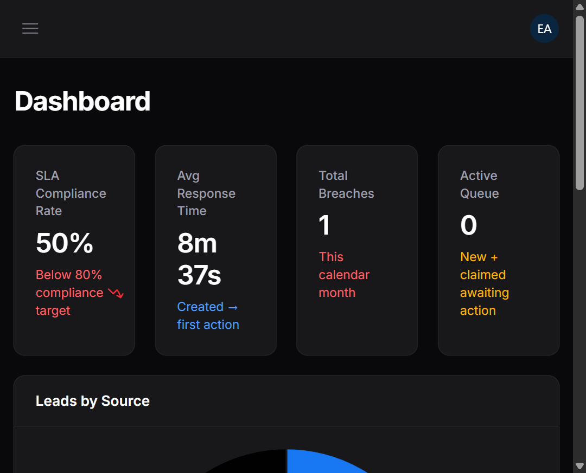
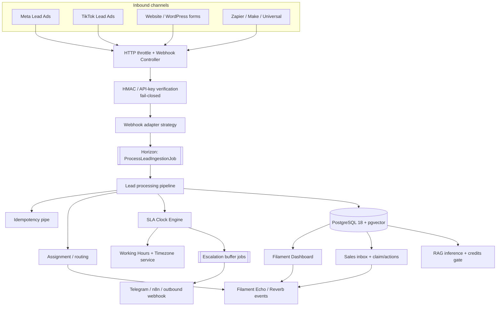
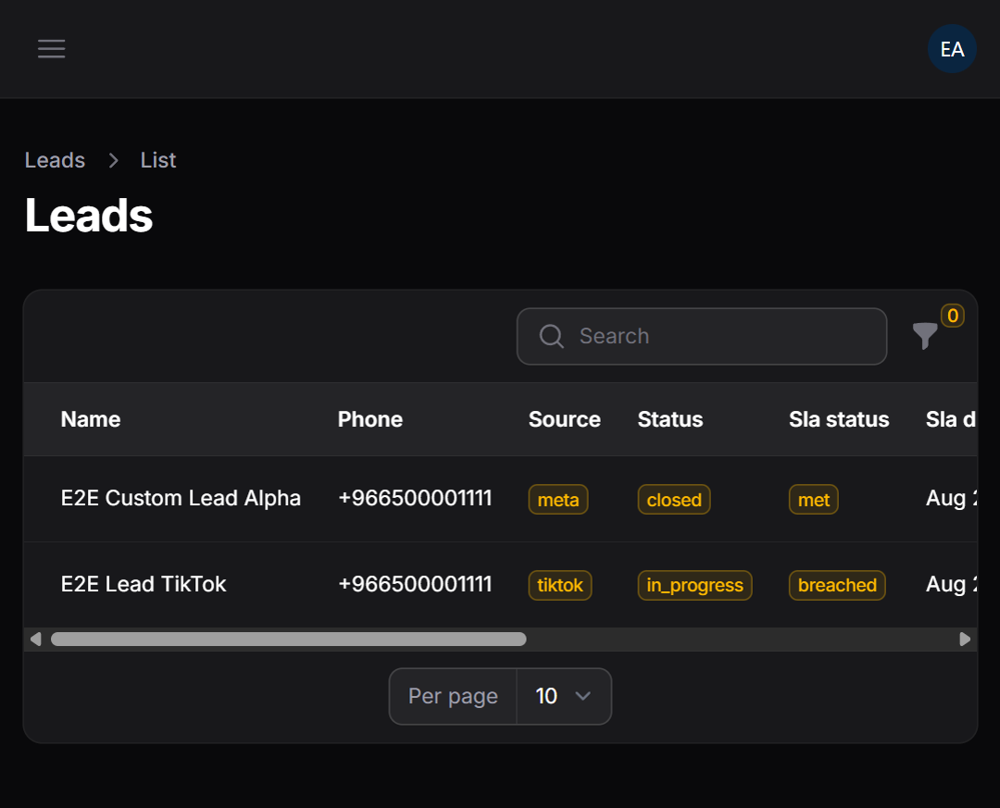
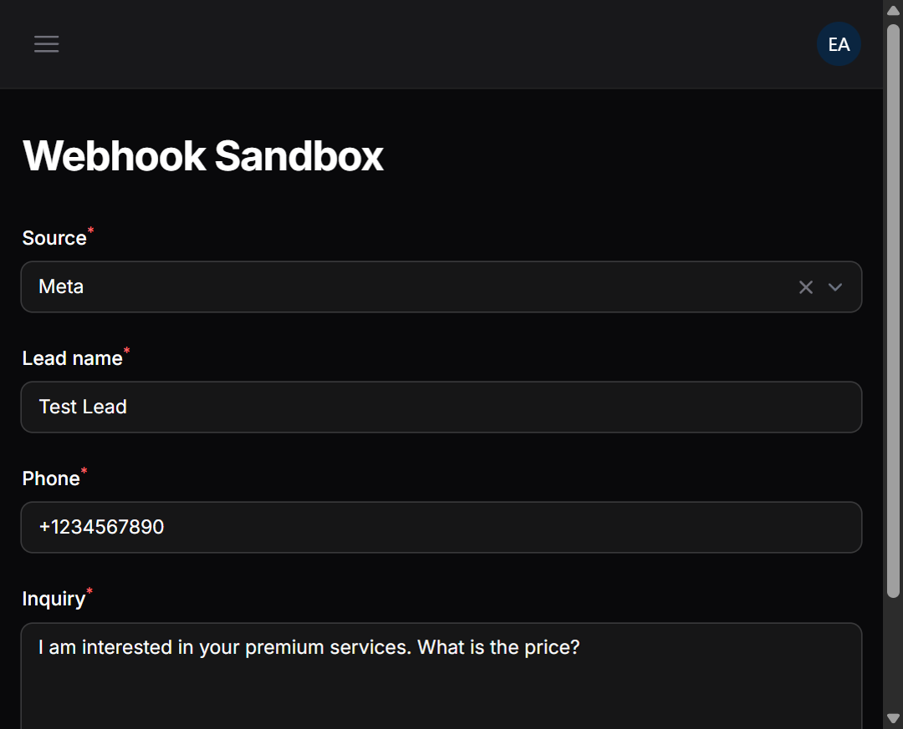
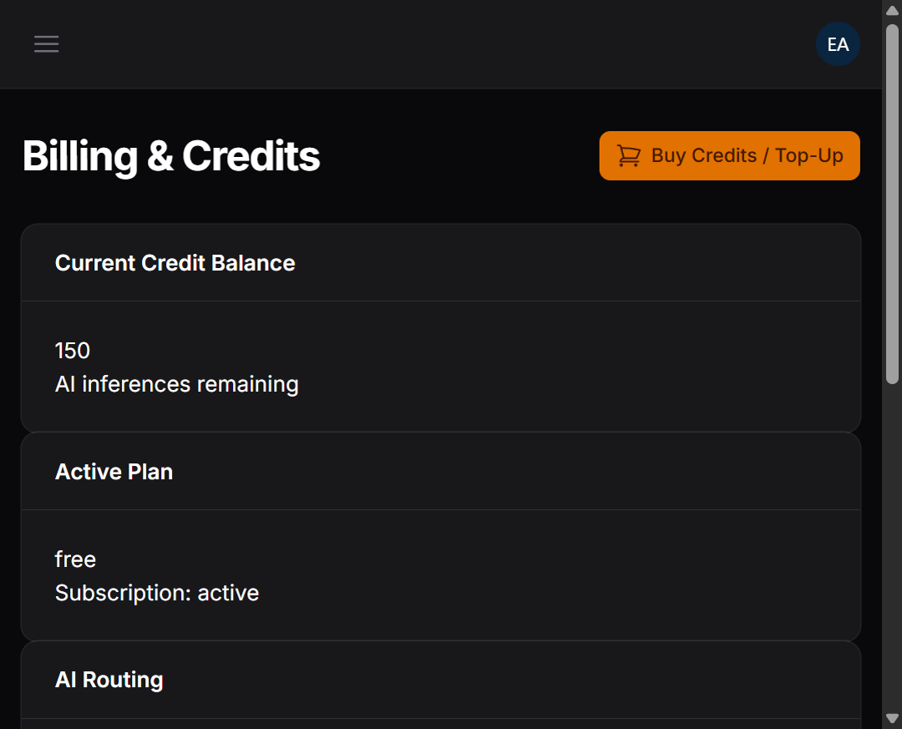

# FirstTouch SLA

### Enterprise multi-tenant lead distribution & SLA enforcement engine

[](https://github.com/yousefbzaqout/firsttouch-sla/actions/workflows/ci.yml)
[](#tech-stack)
[](#tech-stack)
[](#tech-stack)
[](LICENSE)
[](SECURITY.md)
[](#quality-assurance)

> **Portfolio centerpiece** — a production-shaped backend system for ultra-low-latency webhook ingestion, deterministic SLA clocks, intelligent escalation buffers, and tenant-safe operations UI.

<p align="center">
  
</p>

---

## Executive summary

**FirstTouch SLA** is a multi-tenant SLA tracking and lead distribution platform built for sales organizations that cannot afford slow first contact.

It ingests leads from advertising and website channels, verifies signatures **fail-closed**, assigns agents with race-condition-safe claiming, starts a **business-hours-aware SLA clock**, escalates through buffer thresholds, optionally answers via a **confidence-gated RAG** path, and surfaces everything in a Filament operations console with role boundaries.

This repository is designed to demonstrate senior backend engineering: SOLID/OCP integrations, DDD-flavored boundaries, strict multi-tenancy, queue-backed reliability, and security-first webhook handling.

---

## System architecture



Deep dive: [`docs/ARCHITECTURE.md`](docs/ARCHITECTURE.md)

---

## Key technical highlights & engineering decisions

### Multi-tenancy with hard boundaries
- Single-database discriminator (`tenant_id`) with `BelongsToTenant` + Eloquent global scopes
- Filament RBAC so sales reps cannot reach settings, billing, sandbox, or knowledge-base admin surfaces
- Developer API tokens scoped through Sanctum abilities + tenant middleware

### Deterministic SLA engine
- Deadline calculation accounts for tenant timezone and working-hours windows
- Off-hours can freeze the clock and resume at the next open shift
- Invalid timezones are rejected in settings UI and safely resolved at runtime

### Race-condition resilient claiming
- Atomic lead claim paths with `lockForUpdate` / conditional updates
- Prevents double-assignment under concurrent sales activity

### Webhook security (fail-closed)
- Per-source adapters (Meta, TikTok, Google, Snapchat, Universal, Website)
- Dynamic HMAC / shared-secret verification
- Missing secrets reject ingestion instead of silently accepting traffic
- Encrypted secret storage for tenant webhook credentials

### Background reliability
- Laravel Horizon supervising Redis queues (`default`, `high`, `notifications`)
- Retries, backoffs, and scheduled SLA breach sweeps via Sail scheduler sidecar
- Escalation buffers (warning + reassignment thresholds) without blocking request threads

### Guarded AI path
- Knowledge chunking + embeddings into pgvector
- Confidence threshold + credit ledger before AI responses
- Automatic fallback to human-only when credits are exhausted or context is weak

---

## Tech stack matrix

| Layer | Technology |
|-------|------------|
| **Runtime** | PHP **8.5+**, Laravel **13**, FrankenPHP-ready Docker images |
| **Admin / UI** | Filament **v5**, Livewire, Tailwind-powered panel |
| **Data** | PostgreSQL **18** + **pgvector** |
| **Cache / queues** | Redis + **Laravel Horizon** |
| **Realtime** | Laravel Reverb / Echo hooks (Pusher-compatible config) |
| **Auth API** | Laravel Sanctum |
| **Payments** | Driver abstraction (`mock` locally, Stripe-ready) |
| **Notifications** | Telegram, n8n workflow bridge, outbound CRM webhooks |
| **Quality** | Pest PHP, PHPStan **Level 8**, Laravel Pint, GitHub Actions CI |

> Stack badges and docs reflect the **actual** versions in `composer.json` (not older marketing placeholders).

---

## Product surfaces

| Persona | Capabilities |
|---------|--------------|
| **Tenant owner / admin** | Analytics dashboard, team, tenant settings, billing/credits, KB, webhook sandbox, developer API |
| **Sales rep** | Scoped lead inbox, claim, mark contacted, status updates, notes, online presence toggle |
| **Integrations** | HMAC webhooks + website API key ingestion + Sanctum developer API |

<p align="center">
  
</p>

<table>
  <tr>
    <td width="50%">
      
      <p align="center"><sub>Webhook Sandbox — simulate ad-platform payloads safely</sub></p>
    </td>
    <td width="50%">
      
      <p align="center"><sub>Billing & Credits — packages + mock checkout path</sub></p>
    </td>
  </tr>
</table>

---

## Local setup (Laravel Sail)

### Prerequisites
- Docker Desktop / Docker Engine
- Free local ports: `80`, `5432`, `6379`, `8025` (Mailpit), `5678` (n8n)

### Steps

```bash
git clone https://github.com/yousefbzaqout/firsttouch-sla.git
cd firsttouch-sla

# Install PHP deps if vendor/ is missing
docker run --rm -u "$(id -u):$(id -g)" -v "$(pwd):/var/www/html" \
  -w /var/www/html laravelsail/php84-composer:latest composer install

cp .env.example .env
./vendor/bin/sail up -d
./vendor/bin/sail artisan key:generate
./vendor/bin/sail artisan migrate --seed
./vendor/bin/sail npm install && ./vendor/bin/sail npm run build
```

### Open locally
- Filament panel → http://localhost/admin  
- Mailpit → http://localhost:8025  
- n8n (optional) → http://localhost:5678  
- Horizon → http://localhost/horizon (authenticated)

Create your first tenant via Filament **Register**. Do not commit real API keys — leave AI/Stripe/webhook secrets empty for mock/local flows.

---

## API & webhook reference

Base prefix: `/api`

### Auth
| Method | Path | Notes |
|--------|------|-------|
| `POST` | `/api/v1/auth/register` | Throttled tenant registration |
| `POST` | `/api/v1/auth/forgot-password` | Password reset request |
| `POST` | `/api/v1/auth/reset-password` | Password reset confirm |

### Inbound webhooks (HMAC / API key)
| Method | Path | Source |
|--------|------|--------|
| `POST` | `/api/v1/webhooks/meta/{tenant_id}` | Meta |
| `POST` | `/api/v1/webhooks/tiktok/{tenant_id}` | TikTok |
| `POST` | `/api/v1/webhooks/google/{tenant_id}` | Google Ads |
| `POST` | `/api/v1/webhooks/snapchat/{tenant_id}` | Snapchat |
| `POST` | `/api/v1/webhooks/universal/{tenant_id}` | Zapier / Make |
| `POST` | `/api/v1/webhooks/website/{tenant_id}` | Website form (`X-Website-Api-Key`) |
| `POST` | `/api/v1/webhooks/telegram/{tenant_id}` | Telegram callbacks |

### Payments
| Method | Path | Notes |
|--------|------|-------|
| `POST` | `/api/v1/payments/webhook/{driver}` | Stripe / mock payment events |

### Developer API (Sanctum)
| Method | Path | Notes |
|--------|------|-------|
| `GET` | `/api/v1/developer/leads` | Tenant-scoped lead list |
| `GET` | `/api/v1/developer/leads/{id}` | Lead detail |
| `GET` | `/api/v1/developer/analytics/sla-summary` | SLA analytics summary |
| `POST` | `/api/v1/developer/tokens` | Issue token |
| `DELETE` | `/api/v1/developer/tokens/{tokenId}` | Revoke token |

---

## Quality assurance

```bash
# Format (PSR-12 / Laravel style)
./vendor/bin/sail pint

# Tests
./vendor/bin/sail test

# Static analysis (Level 8)
./vendor/bin/sail exec laravel.test ./vendor/bin/phpstan analyse --memory-limit=1G
```

CI (`.github/workflows/ci.yml`) on every `push` / `pull_request` to `main`:

1. PHP 8.5 + Composer  
2. PostgreSQL (`pgvector/pgvector:pg18`) + Redis services  
3. Migrate  
4. Pest (parallel)  
5. PHPStan Level 8  

Security policy: [`SECURITY.md`](SECURITY.md)

---

## Repository map

```text
app/
  Adapters/       Webhook + notification strategies (OCP)
  Casts/          Safe backed-enum hydration
  DTOs/           Immutable transfer objects
  Enums/          Domain state machines
  Filament/       Ops console, widgets, RBAC pages
  Pipelines/      Lead ingestion pipes
  Services/       SLA, RAG, billing, assignment
docs/
  ARCHITECTURE.md
  screenshots/
routes/api.php    Webhooks + developer API
tests/            Feature, unit, simulation suites
```

---

## Intentional scope notes

Shipped and demonstrated end-to-end:

- Multi-tenant console + sales RBAC  
- Multi-source ingestion + sandbox  
- SLA lifecycle + escalation buffers  
- Knowledge base + RAG credit pipeline  
- Mock billing top-up path  

Intentionally lean (documented, not accidental gaps):

- Working-hours UI editor (hours seeded at registration)  
- Escalation threshold constants live in the buffer service (not a settings form)

---

## Author

Built by **Yousef Bzaqout** as an enterprise-style portfolio system: architecture first, security by default, green CI required.

If you are reviewing for hiring, start here:

1. [`docs/ARCHITECTURE.md`](docs/ARCHITECTURE.md)  
2. `app/Pipelines` + `app/Adapters/Webhooks`  
3. `app/Services/Sla`  
4. `tests/Feature`

---

## License

Released under the [MIT License](LICENSE).
