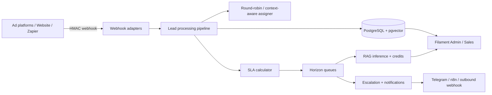

# Architecture Overview

FirstTouch SLA is a **multi-tenant lead response platform**. Every inbound marketing lead is ingested, assigned, timed against a business-hours SLA, optionally answered by a guarded RAG pipeline, and surfaced in a Filament operations console.

## High-level flow

## Core bounded contexts

| Context | Responsibility |
|---------|----------------|
| **Tenancy** | Single-database discriminator (`tenant_id`), `BelongsToTenant`, Filament RBAC |
| **Ingestion** | Strategy-pattern webhook adapters + idempotent pipeline pipes |
| **SLA** | Working-hours aware deadlines, freeze/resume, 50%/80% escalation buffers |
| **Assignment** | Round-robin + tag/context-aware routing |
| **Knowledge / RAG** | Chunking, embeddings, vector search, confidence gate, credit deduction |
| **Billing** | Payment driver abstraction (`mock` / Stripe), credit ledger |
| **Ops UI** | Filament resources, analytics widgets, webhook sandbox, developer API |

## Pipeline (ingestion)

Typical pipe order:

1. Verify HMAC / API key (adapter-specific)
2. Map payload → `LeadData` DTO
3. Idempotency check on `(tenant_id, external_lead_id)`
4. Assign sales rep
5. Calculate SLA deadline (timezone + working hours)
6. Persist lead + dispatch domain events / jobs

Blank external IDs are stored as `NULL` so uniqueness remains correct under PostgreSQL.

## Runtime topology (Sail)

| Service | Role |
|---------|------|
| `laravel.test` | HTTP / Filament / API |
| `horizon` | Redis queues (`default`, `high`, `notifications`) |
| `scheduler` | SLA breach checks, daily free credits |
| `pgsql` | PostgreSQL 18 + `pgvector` |
| `redis` | Cache + queues |
| `mailpit` | Local mail |
| `n8n` | Optional notification workflow runner |

## Design principles encoded in the codebase

- **Strict typing** — `declare(strict_types=1);` + backed enums for domain state
- **OCP for integrations** — webhook adapters & notification/payment drivers behind factories
- **Fail closed** — missing webhook secrets reject requests instead of silently accepting
- **Tenant safety by default** — scopes + Filament authorization, not “remember to filter”
- **Observable ops** — Horizon, structured jobs, escalation buffers, analytics widgets
